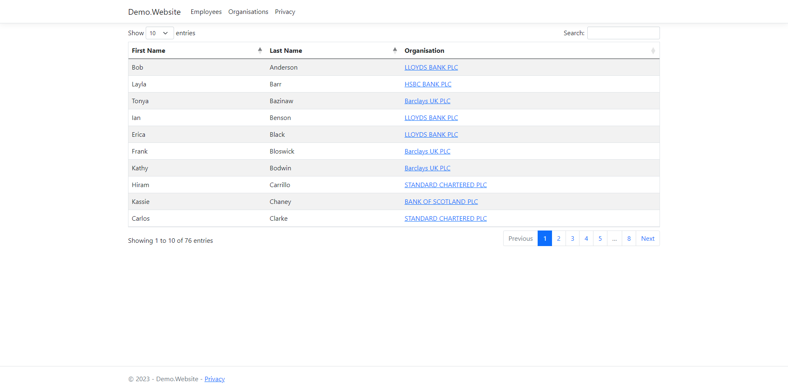

# Valutex Demo

An ASP.NET website that displays organisations and employees stored in a SQL database, using [EntityFramework](https://learn.microsoft.com/en-us/aspnet/entity-framework) to retrieve and persist data.

To run the website, [SQL Server Express](https://learn.microsoft.com/en-us/sql/database-engine/configure-windows/sql-server-express-localdb?view=sql-server-ver16) must be installed or the connection string for an accessible SQL server must be added to `appsettings.json`. When starting for the first time Entity Framework will run migrations that create the required tables and add sample data.

## Pages
- `/Organisations` - Displays a table containing all organisations in the Organisations table
- `/Organisation/<organisation number>` - Displays more information for a given organisation
- `/Employees` - Displays a table containing all employees in the Employees table

## API

The website contains a REST API with `GET`, `POST`, `PUT` and `DELETE` endpoints for the Organisation and Employee entities. These can be viewed and interacted with using the generated [swagger-ui](https://swagger.io/tools/swagger-ui/) page  at `/api/swagger`.
